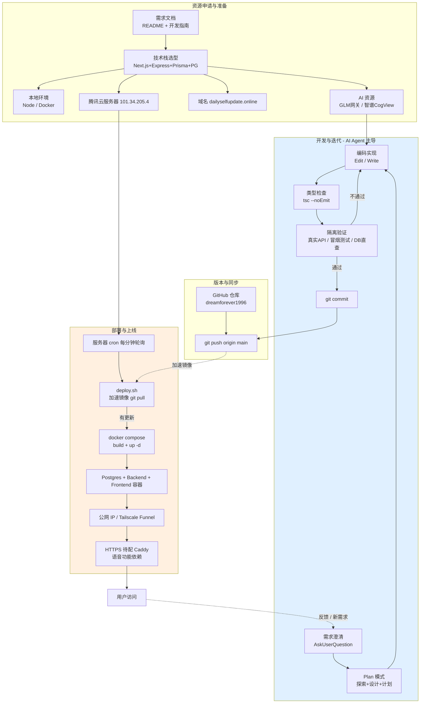
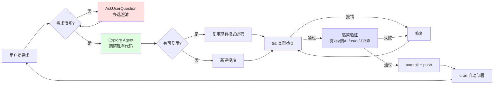
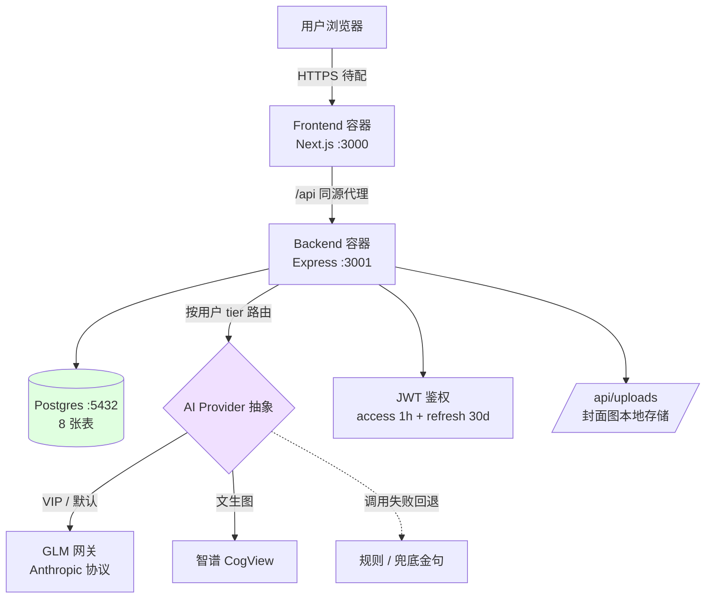

# DailySelfUpdate · 架构与研发流程

> 本文档说明项目从**资源申请 → 准备 → 开发 → 迭代 → 部署 → 上线**的完整流程，
> 并附运行时系统架构与 AI Agent 辅助研发流程分析。所有图为 Mermaid，GitHub 可直接渲染。

---

## 1. 全流程总览（资源 → 开发 → 部署 → 上线）



**过程说明**：
- **资源准备**：需求文档定方向，技术栈一次性敲定；其中**域名、服务器、各类 AI key 必须人工申请**（要登录控制台 / 充值 / 实名），是 Agent 无法自动完成的边界。
- **开发迭代**：由 AI Agent 主导，"澄清 → 计划 → 编码 → 检查 → 验证"形成闭环，验证不过自动退回重改。
- **同步**：本地 push 到 GitHub；国内服务器拉取走加速镜像（直连 GitHub 不稳）。
- **部署**：服务器 cron 每分钟跑 `deploy.sh`，检测到新 commit 才重建容器（无更新即跳过，省资源）。
- **上线 → 反馈**：用户使用后提出新需求，回到澄清环，形成持续迭代。

---

## 2. 单次迭代的 Agent 工作循环



**过程说明**：每个功能（如"每日书句""AI 整理""书籍弹窗"）都走这个环——先澄清产品决策，再探索可复用资产（避免重复造轮子），编码后必经类型检查 + 隔离验证（用真实 GLM 网关 token 跑、curl 端到端、psql 直查），通过才提交。

---

## 3. 运行时系统架构（部署后拓扑）



**过程说明**：
- 前端 Next.js 与后端 Express 分容器，前端用相对路径 `/api` 同源调后端（免 CORS）。
- 后端按用户 **tier（free/vip）** 路由到不同 AI provider；AI 全部带超时 + **失败优雅回退**（规则推荐 / 兜底金句），保证核心功能永不因 AI 挂掉。
- 文生图（周总结封面）走智谱 CogView，生成后下载存本地 `/api/uploads`，避免远程 URL 过期。

---

## 4. 是否符合 AI Agent 辅助研发通用流程？

### 实际遵循的流程
```
需求澄清 → 代码探索 → 计划先行 → 增量编码 → 类型检查 → 隔离验证 → 提交 → 自动部署 → 用户反馈 → 下一轮
```

### 对比通用做法

| 环节 | 业界 AI Agent 通用做法 | 本项目 | 评价 |
|---|---|---|---|
| 需求澄清 | 对话式追问 | AskUserQuestion 多选确认 | 标准 |
| 代码探索 | 语义检索 / RAG | Explore agent + grep | 标准 |
| 计划先行 | Plan / think 模式 | Plan mode + 写计划文件 | 标准 |
| 增量编码 | 小步 diff | Edit / Write | 标准 |
| 验证 | 跑测试 / 类型检查 | tsc + 真实 API 隔离测试 + DB 直查 | **优于平均** |
| 版本控制 | git + PR + review | git，直接 push main，无 PR/CI | 偏简化 |
| 部署 | CI/CD 流水线（推模式） | cron 轮询 + deploy.sh（拉模式） | 非主流但务实 |

### 核心差别（4 点）

1. **验证更扎实**：通用流程常止步"能编译"，本项目每次用真实 key 隔离测 + curl 端到端 + psql 直查，比平均严谨。
2. **缺正式 CI/CD 与测试门禁**：无 GitHub Actions、无 PR review、`smoke.sh` 靠手动跑。个人项目够用，团队/生产级偏弱。
3. **拉模式部署**：cron 每分钟拉取（被动、有延迟），是国内服务器连 GitHub 不稳的务实妥协；通用做法是 webhook/Actions 推模式（即时）。
4. **人在环路位置**：人深度参与**外部资源申请/配置**（域名、服务器、AI key、实名充值）——这是 AI Agent 当前的硬边界。

### 结论
**开发-迭代环（澄清→探索→计划→编码→验证→提交）= 当下 AI Agent 辅助研发的标准范式**，验证环节做得更严。
差距集中在**工程化基础设施层**：缺 CI/CD 自动门禁、缺测试覆盖、用拉模式部署——是本项目定位（个人、快速迭代、国内服务器约束）下的合理取舍。
若向团队/生产级演进，补齐 **GitHub Actions（lint + test + build 门禁）+ webhook 推部署 + 单元/E2E 测试** 即可对齐工业级通用流程。
